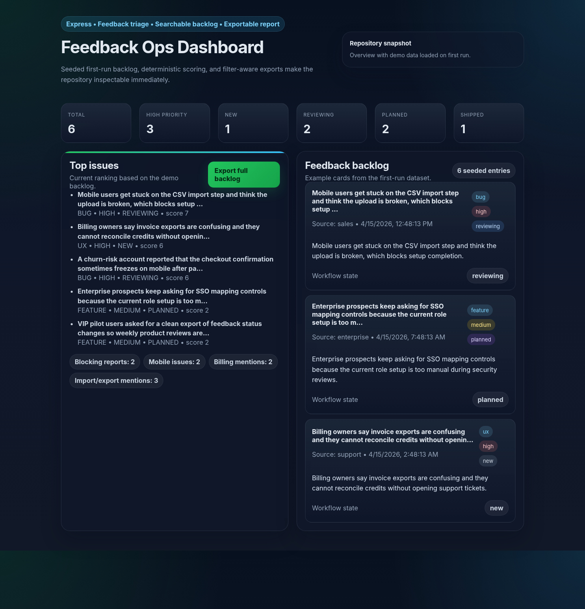
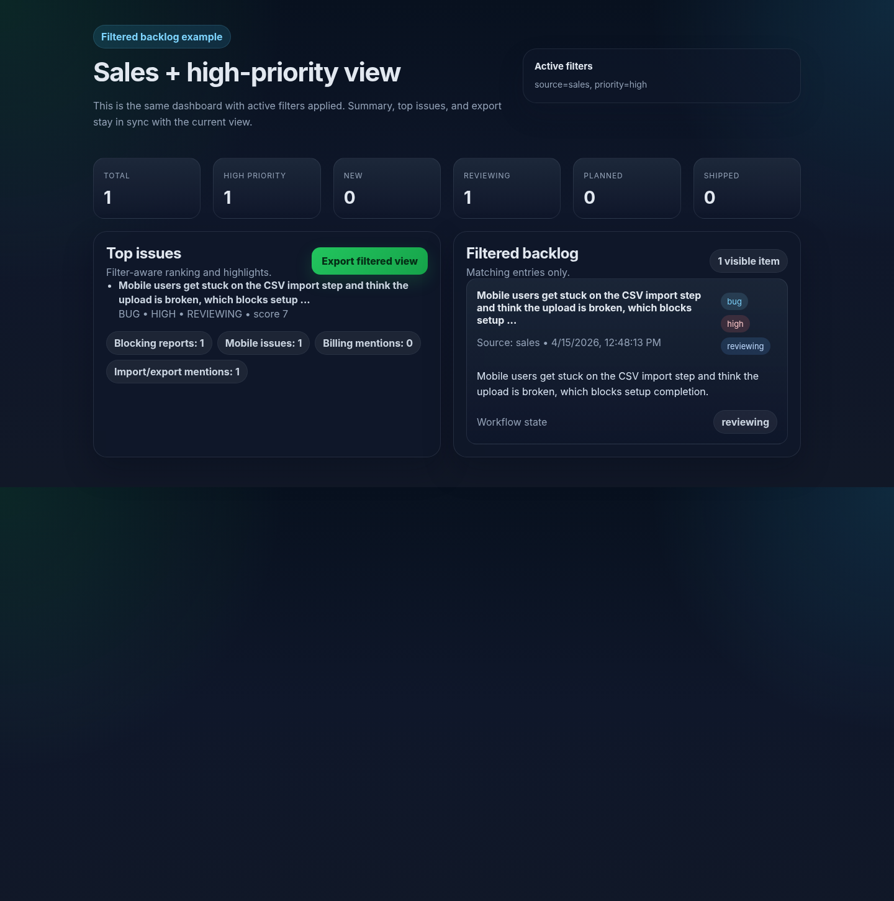
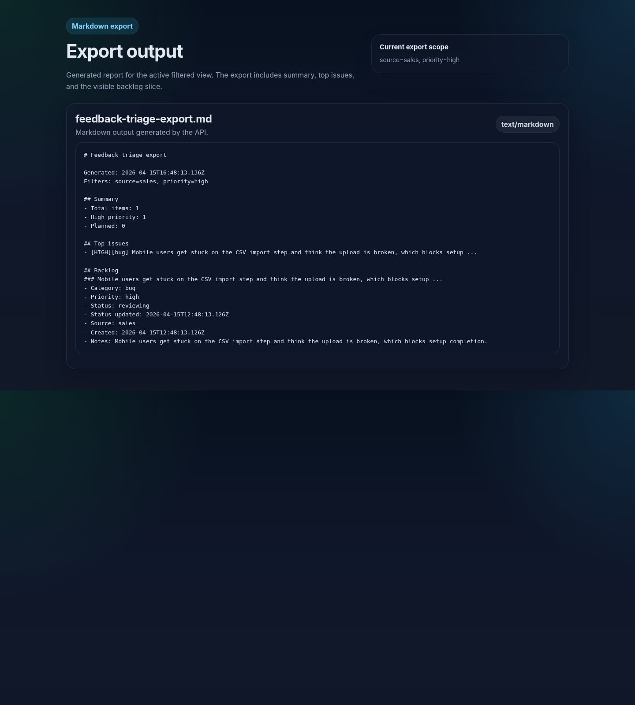

# Feedback Ops Dashboard

Compact fullstack dashboard for turning raw customer feedback into a prioritized backlog.
It is intentionally small, but it is not an empty shell: first run loads a realistic demo backlog,
status changes are persisted locally, and the whole flow is testable end to end.

## What this repository demonstrates
- Explicit backend boundaries: validation, prioritization rules, persistence, and HTTP wiring are separate.
- Deterministic scoring instead of opaque heuristics.
- Review-friendly local setup with no external services required.
- Filterable backlog, filter-aware Markdown export, and workflow state transitions.
- Local persistence with atomic writes and recovery from corrupted storage.

## Screenshots
### Overview


### Filtered backlog view


### Markdown export output


## Core capabilities
- Capture feedback with a constrained source taxonomy.
- Classify entries into `bug`, `ux`, `feature`, or `support`.
- Score urgency and impact using deterministic rules.
- Track workflow state across `new`, `reviewing`, `planned`, and `shipped`.
- Filter by source, category, priority, status, and free-text query.
- Export the current backlog view as Markdown for planning reviews.
- Bootstrap a demo dataset automatically on first run so the UI is inspectable immediately.

## Architecture at a glance
- **Backend:** Express API with a small route surface.
- **Frontend:** Vanilla JavaScript UI with explicit loading and error states.
- **Persistence:** File-based store for a low-friction local demo.
- **Testing:** Node built-in test runner for prioritization logic and API-level integration checks.

## Stack
- Node.js 20+
- Express 4
- Vanilla JavaScript
- Plain CSS

## Project structure
```text
lib/
  classify.js      Deterministic classification and scoring
  constants.js     Shared domain enums
  demo-data.js     First-run demo backlog
  load-env.js      Minimal .env loader without runtime dependency bloat
  store.js         Persistence, summaries, and Markdown export
  validation.js    Request validation
public/
  app.js           Client-side state and rendering
  index.html       UI shell
  styles.css       Styling
server.js          Entry point and env bootstrap
app.js             Express app and API routes
test/              Unit and API tests
```

## Run locally
```bash
npm ci
cp .env.example .env
npm start
```

Open `http://localhost:4000`.

### First-run behavior
On the first start, the app creates `data/feedback-store.json` with demo feedback items.
That makes the repository reviewable immediately instead of opening on an empty dashboard.

To start with a clean file instead of demo data:
```bash
FEEDBACK_SEED_MODE=empty npm start
```

## Environment variables
```bash
PORT=4000
FEEDBACK_STORAGE_PATH=./data/feedback-store.json
FEEDBACK_SEED_MODE=demo
```

## Available scripts
```bash
npm start
npm run lint
npm test
```

## API
- `GET /api/health`
- `GET /api/feedback`
- `POST /api/feedback`
- `PATCH /api/feedback/:id/status`
- `GET /api/summary`
- `GET /api/export.md`

### Example payload
```json
{
  "text": "Mobile users get stuck on the import step and think the upload is broken.",
  "source": "sales"
}
```

Allowed `source` values: `manual`, `sales`, `support`, `demo`, `churn`, `enterprise`, `vip`.

## Export behavior
Markdown export follows the current active filters.
If the dashboard is filtered to `source=sales&priority=high`, the export contains the same filtered summary,
ranked issues, and backlog slice.

### Example export output
```md
# Feedback triage export

Generated: 2026-04-15T16:48:13.136Z
Filters: source=sales, priority=high

## Summary
- Total items: 1
- High priority: 1
- Planned: 0

## Top issues
- [HIGH][bug] Mobile users get stuck on the CSV import step and think the upload is broken, which blocks setup ...

## Backlog
### Mobile users get stuck on the CSV import step and think the upload is broken, which blocks setup ...
- Category: bug
- Priority: high
- Status: reviewing
- Source: sales
```

## Testing
```bash
npm test
```

Current tests cover:
- classification and priority rules
- request validation and source taxonomy
- API create/update flow
- filtered summary behavior
- filtered export behavior
- malformed JSON handling

## Tradeoffs
- File-based persistence keeps the repo easy to run, but a production version should move to SQLite or PostgreSQL.
- Concurrency is serialized inside one Node process; multi-process coordination would still require a real database.
- Classification is deterministic by design so the behavior stays inspectable and testable.
- The UI stays intentionally small: one screen, one workflow, no auth or role model.

## What I would do next in production
- Move persistence from the JSON file store to SQLite or PostgreSQL with migrations.
- Add structured audit history for status transitions instead of only storing the latest state.
- Add a small e2e browser smoke test for the capture → filter → export flow.
- Introduce rate limiting and request logging for the API surface.
- Add pagination or virtualized rendering once backlog size grows beyond a lightweight local demo.
